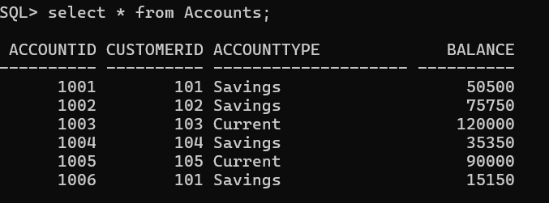
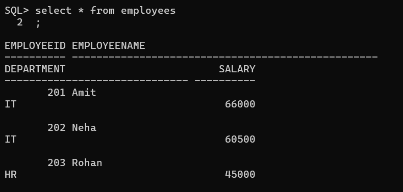

# Stored Procedures

## 1st Scenario

### Before Execution

### After Execution

---

## 2nd Scenario

### Before Execution

### After Execution

---

## 3rd Scenario

### Before Execuion

### After Execution

